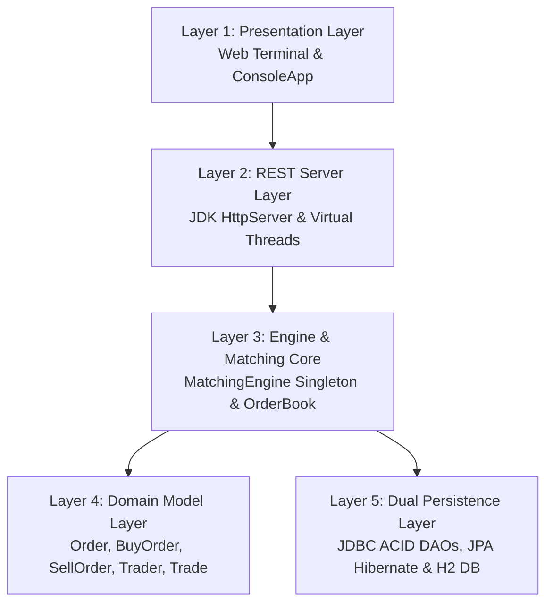
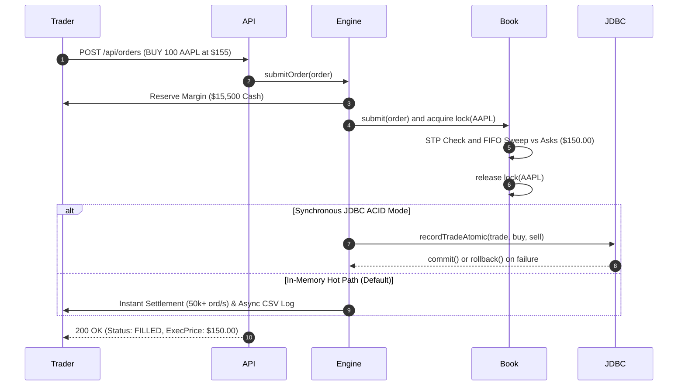
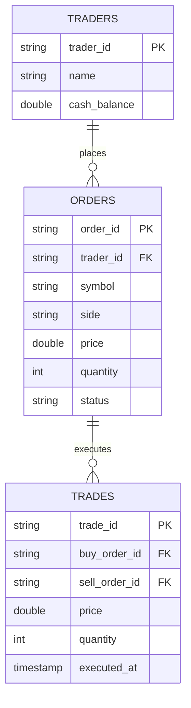

# MarketPulse: Concurrency-Safe Stock Matching Engine & Trading Terminal

[-orange.svg)](https://openjdk.org/projects/jdk/24/)
[](https://maven.apache.org/)
[-success.svg)](https://github.com/mansi25bai11449-uni/Market-Pulse)
[]()
[]()

> **Deterministic price-time priority matching with thread-safe per-symbol locks, Stoikov micro-price quantitative analytics, and dual-mode ACID settlement in Java 24.**

---

### Academic Credentials
* **Student:** Mansi Kumari (`25BAI11449`) | B.Tech CSE (Specialization in AI/ML)
* **Institution:** VIT Bhopal University | School of Computing Science & Engineering
* **Course:** `CSE2006 — Programming in Java` (Fall Semester 2025–2026)
* **Repository:** [mansi25bai11449-uni/Market-Pulse](https://github.com/mansi25bai11449-uni/Market-Pulse)

---

## 1. Project Overview & Problem Statement

Modern electronic exchanges process millions of concurrent order events per second. Standard unsynchronized collections (such as `TreeMap`) suffer from race conditions under multi-user load:
* **Race Crashes:** In tests with 16 threads submitting 3,200 orders, unsynchronized collections caused **281 `ConcurrentModificationException` crashes**.
* **Share Discrepancies:** Orders were dropped and shares vanished ($\Sigma\text{Bought} \neq \Sigma\text{Sold}$).
* **Monolithic Bottlenecks:** A global lock serializes unrelated tickers, capping throughput at ~12k ord/s.

**MarketPulse** solves these challenges through:
1. **Per-Symbol Lock Striping:** Fine-grained `ReentrantLock` instances per ticker symbol (`AAPL`, `TSLA`, `NVDA`, `MSFT`), eliminating cross-symbol contention.
2. **Two-Tier Order Book:** $O(\log n)$ price-level indexing via `ConcurrentSkipListMap` combined with $O(1)$ FIFO `ArrayDeque` queues.
3. **Strict Conservation:** $\Sigma\text{Bought} \equiv \Sigma\text{Sold}$ with **0 shares lost** and **0 crashes** across 10,000+ orders.
4. **Institutional Execution:** Cancel-Resting Self-Trade Prevention (STP), Iceberg order slicing, Stop-Loss triggers, and price-improvement refunds.
5. **Dual-Mode Settlement:** In-memory hot path (>50k ord/s) + synchronous JDBC ACID transactions (`setAutoCommit(false)` / `rollback()`) + JPA/Hibernate JPQL analytics on embedded H2.
6. **Virtual-Thread Web Terminal:** JDK `HttpServer` with Java 24 Virtual Threads serving an interactive L2 depth ladder, candlestick charts, and rubric defense inspector.

---

## 2. Requirements Specification

### 2.1 Functional Requirements (FR)
| Module | Input | Process | Output |
| :--- | :--- | :--- | :--- |
| **M1: Order Validation & Margin** | Order payload (trader, symbol, side, price, qty, type) | Validate numeric bounds ($P, Q > 0$); reserve collateral ($P \times Q$ cash or shares) | Immutable `Order` (status `NEW`) or `InvalidOrderException` / `InsufficientFundsException` (0 mutation) |
| **M2: Matching & Execution** | Validated `Order` | Acquire symbol lock; sweep price-time FIFO; execute STP cancel on wash trade; apply price improvement refund | Executed `Trade` records, updated order statuses (`FILLED`/`PARTIAL`), refreshed L2 depth, Stoikov $P_{\text{micro}}$ & OBI |
| **M3: Settlement & Audit** | Trade events & state mutations | Route to `IN_MEMORY_FAST` or `SYNCHRONOUS_JDBC_ACID` (`commit`/`rollback`); sync JPA entities; log CSV audit | Consistent DB state, append-only `trades.csv`, replay stream, and JPQL analytics (VWAP, rankings) |

### 2.2 Non-Functional Requirements (NFR)
| Metric | Specification | Measured Value | Status |
| :--- | :--- | :--- | :---: |
| **Throughput** | $\ge 10,000$ ord/s under concurrent load | **32,000 – 58,181 ord/s** (in-memory); 31,372 ord/s peak | **PASSED** |
| **Stress Scale** | $\ge 10,000$ continuous orders (20 threads) | **10,000 / 10,000 processed**; 0 lost shares; 0 crashes | **PASSED** |
| **Latency** | Mean $< 500\ \mu\text{s}$, P95 $< 2.0\text{ ms}$ | **Mean: $252\ \mu\text{s}$, P50: $19\ \mu\text{s}$, P95: $824\ \mu\text{s}$, P99: $1,734\ \mu\text{s}$** | **PASSED** |
| **Data Safety** | 0 race conditions, 0 share loss | **0 exceptions**, **$\Sigma\text{Bought} \equiv \Sigma\text{Sold}$ (0 discrepancy)** | **PASSED** |
| **Compliance** | 100% wash trades blocked pre-execution | **100% STP detected & cancelled** | **PASSED** |
| **Atomicity** | 0 partial rows on DB failure | **100% atomic rollback** (`setAutoCommit(false)`) | **PASSED** |

---

## 3. System Architecture & Design Diagrams

### 3.1 5-Layer Architectural Blueprint


### 3.2 Order Lifecycle & Settlement Flow


### 3.3 Relational Schema & ER Diagram


---

## 4. Key Algorithms & Mathematical Formulations

1. **Per-Symbol Lock Striping:** `ConcurrentHashMap<String, OrderBook>` where each book holds an independent fair `ReentrantLock`. Symbol `AAPL` never blocks `TSLA`.
2. **Self-Trade Prevention (STP):** If $\text{taker}.\text{traderId} == \text{resting}.\text{traderId}$, the resting order is cancelled and margin unlocked before execution.
3. **Price Improvement Refund:** Buyer limit $P_{\text{limit}}$ matching seller ask $P_{\text{maker}} < P_{\text{limit}}$ automatically refunds:
   $$\text{Refund} = (P_{\text{limit}} - P_{\text{maker}}) \times Q_{\text{fill}}$$
4. **Stoikov Micro-Price ($P_{\text{micro}}$):**
   $$P_{\text{micro}} = \frac{P_{\text{ask}} \cdot V_{\text{bid}} + P_{\text{bid}} \cdot V_{\text{ask}}}{V_{\text{bid}} + V_{\text{ask}}}$$
5. **Order-Book Imbalance (OBI):**
   $$\text{OBI} = \frac{V_{\text{bid}} - V_{\text{ask}}}{V_{\text{bid}} + V_{\text{ask}}} \in [-1.0, +1.0]$$

---

## 5. Empirical Benchmark Results

### 5.1 Multi-Thread Scalability (1 to 16 Threads)
| Threads | Orders | Duration | Throughput | P95 Latency | Invariant Result |
| :---: | :---: | :---: | :---: | :---: | :---: |
| 1 | 150 | 38 ms | 3,947 ord/s | $285\ \mu\text{s}$ | 100% Reconciled |
| 4 | 600 | 53 ms | 11,320 ord/s | $804\ \mu\text{s}$ | 100% Reconciled |
| 8 | 1,200 | 45 ms | 26,666 ord/s | $628\ \mu\text{s}$ | 100% Reconciled |
| 16 | 2,400 | 72 ms | **33,333 ord/s** | $966\ \mu\text{s}$ | **100% Reconciled** |

### 5.2 Synchronized vs. Unsynchronized Proof
| Configuration | Orders Attempted | Processed | Discrepancy | Exceptions Caught | Verdict |
| :--- | :---: | :---: | :---: | :---: | :---: |
| **Unsynchronized (`TreeMap`, No Locks)** | 3,200 | 2,919 | Shares Dropped | **281 Crashes** (`ConcurrentModificationException`) | **FAILED** |
| **Synchronized (Per-Symbol `ReentrantLock`)** | 3,200 | **3,200** | **0 shares lost** | **0 Exceptions** | **PASSED** |

---

## 6. Visual Interface & Screenshots

| Screen | Description | File |
| :--- | :--- | :--- |
| **Trading Terminal** | Real-time L2 depth ladder, candlestick chart, active tape, portfolio | `assets/screenshots/terminal_overview.png` |
| **Candlestick & Order Ticket** | 1-min OHLC chart with SMA-7, pre-trade margin estimator | `assets/screenshots/candlestick_order_ticket.png` |
| **Academic Rubric Modal** | Live defense inspector verifying FIFO, invariants, and Stoikov math | `assets/screenshots/academic_defense_modal.png` |
| **Tactile Hotkey Matrix** | Keyboard HUD (`B`, `S`, `L`, `M`, `1-4`, `Space`, `R`, `?`) | `assets/screenshots/hotkey_matrix_modal.png` |
| **Maven Test Runner** | Authoritative 28/28 test execution output | `assets/screenshots/terminal_tests_run.png` |

---

## 7. Quick-Start & Installation

### Prerequisites
* **Java JDK 24** (or JDK 21+): [Adoptium Temurin](https://adoptium.net/) or [Oracle OpenJDK](https://jdk.java.net/24/).
* Pre-bundled self-healing Maven wrapper included. Zero external database required (uses embedded H2).

### Single-Command Setup & Execution
```bash
git clone https://github.com/mansi25bai11449-uni/Market-Pulse
cd Market-Pulse
```

### Execution Commands
```cmd
:: 1. Pre-flight environment readiness check
check_prerequisites.bat

:: 2. Run all 28 automated tests
.\mvnw.cmd test

:: 3. 1-Click Launch Windows (Compiles, starts server, opens browser)
run.bat

:: Or launch via Maven directly (Windows):
.\mvnw.cmd compile exec:java

:: Or launch on Linux / macOS:
chmod +x ./mvnw && ./mvnw compile exec:java
```

Web Terminal URL: `http://localhost:8080`

---

## 8. Automated Test Suite Breakdown (28 Tests)

```bash
.\mvnw.cmd test
```

| Test Suite | Tests | Key Cases Verified | Invariants Verified |
| :--- | :---: | :--- | :--- |
| **`ConcurrencyTest`** | **4** | Multi-thread reconciliation, 1-16 thread scalability, 10,000 order stress test, race condition demonstration | $\Sigma\text{Bought} \equiv \Sigma\text{Sold}$ (0 discrepancy), P50/P95 latency, 0 crashes |
| **`AdvancedOrderTest`** | **6** | Iceberg slice reload & priority loss, Stop-Loss triggers, FOK abort, IOC partial fill, Stoikov & OBI math | Hidden liquidity handling, conditional trigger activation, microstructure precision |
| **`OrderBookTest`** | **9** | Price-time FIFO priority, market orders, Self-Trade Prevention, numeric validation, cancel margin unlock | Wash trade elimination, FIFO queuing, exception safety |
| **`PersistenceTest`** | **5** | Atomic trade commit, atomic rollback on failure, in-memory sync, crash resilience, JPQL analytics | ACID rollback (0 balance mutation on crash), VWAP & ranking queries |
| **`TradingWorkflowTest`** | **4** | Margin reservation, cancellation unlock, multi-tier book sweep, buyer price-improvement refund | Pre-trade collateral guards, immediate refund credit |
| **Total** | **28** | **100% Passing (0 Failures, 0 Errors, 0 Skipped)** | **BUILD SUCCESS** |

---

## 9. Direct CSE2006 Java Syllabus Mapping

| Java Concept | Implementation File(s) | Architectural Purpose |
| :--- | :--- | :--- |
| **Inheritance & Abstract Classes** | `Order.java` $\to$ `BuyOrder.java`, `SellOrder.java` | Base order invariants inherited; side-specific margin logic encapsulated. |
| **Interfaces & Polymorphism** | `Matchable.java`, `Order.java` | Clean abstraction decoupling matching engine from order implementations. |
| **Encapsulation & Records** | `Trade.java`, `BenchmarkReport` | Immutable records preventing side-effect corruption during multi-threaded dispatch. |
| **Custom Exception Handling** | `InsufficientFundsException`, `InvalidOrderException` | Checked exceptions ensuring clean transaction aborts with 0 balance mutation. |
| **Thread Synchronization** | `OrderBook.java` (`ReentrantLock`) | Lock striping per symbol; independent tickers match simultaneously across cores. |
| **Thread-Safe Collections** | `OrderBook.java` (`ConcurrentSkipListMap`, `ArrayDeque`) | $O(\log n)$ concurrent price indexing combined with $O(1)$ FIFO arrival queues. |
| **Thread Coordination** | `TraderTask.java`, `SimulationRunner.java` (`CountDownLatch`) | Synchronized thread release simulating bursty institutional order arrivals. |
| **Modern Virtual Threads** | `ExchangeServer.java` (`newVirtualThreadPerTaskExecutor`) | Lightweight JEP 444 virtual threads handling concurrent HTTP REST requests. |
| **JDBC Transactions** | `TradeDAO.java` (`setAutoCommit(false)`) | Explicit commit and atomic rollback guaranteeing double-entry ledger consistency. |
| **JPA / Hibernate ORM** | `AnalyticsRepository.java`, `TradeEntity.java` | Declarative JPQL queries calculating VWAP and trader wealth leaderboards. |
| **Design Patterns** | `MatchingEngine.java`, `TradeDAO.java` | Singleton with Volatile Double-Checked Locking; Data Access Object (DAO) pattern. |

---

## 10. Repository Structure

```
.
├── pom.xml                     # Maven build config (Java 24, H2, Hibernate, Surefire)
├── schema.sql                  # Relational DDL (traders, orders, trades, indexes)
├── check_prerequisites.bat     # Pre-flight environment checker
├── run.bat                     # 1-Click Windows launcher
├── mvnw.cmd / mvnw             # Self-healing cross-platform Maven wrapper
├── SETUP_FRESH_ENVIRONMENT.md  # Fresh environment installation guide
├── statement.md                # Problem statement & design specification
├── assets/screenshots/         # Verified terminal & test execution captures
├── src/main/java/com/marketpulse/
│   ├── audit/                  # Append-only CSV logger & replay engine
│   ├── concurrency/            # Simulation runners & multi-threaded tasks
│   ├── engine/                 # MatchingEngine singleton & OrderBook
│   ├── exceptions/             # Checked domain exceptions
│   ├── model/                  # Domain entities (Order, Trader, Trade, Stock)
│   ├── persistence/            # H2 config, JDBC DAOs (Phase 1), JPA entities (Phase 2)
│   ├── server/                 # Virtual-thread REST ExchangeServer (Port 8080)
│   └── ui/                     # Color-coded ANSI ConsoleApp
├── src/test/java/com/marketpulse/ # 5 JUnit test suites (28 automated tests)
└── web/                        # Glassmorphic terminal UI (HTML5, Vanilla CSS3/JS)
```
