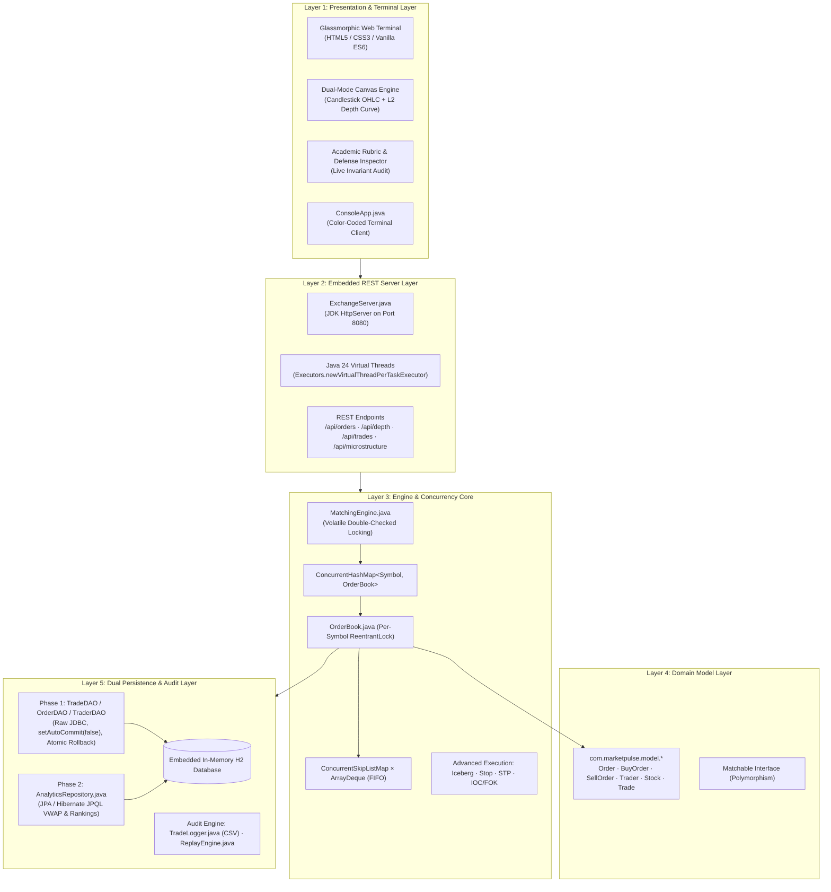
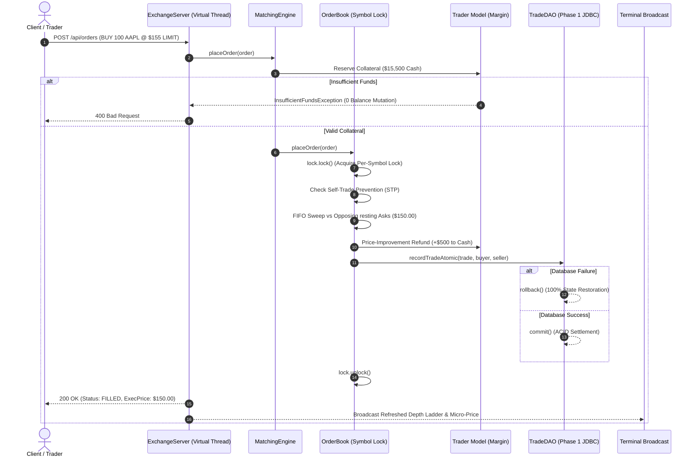
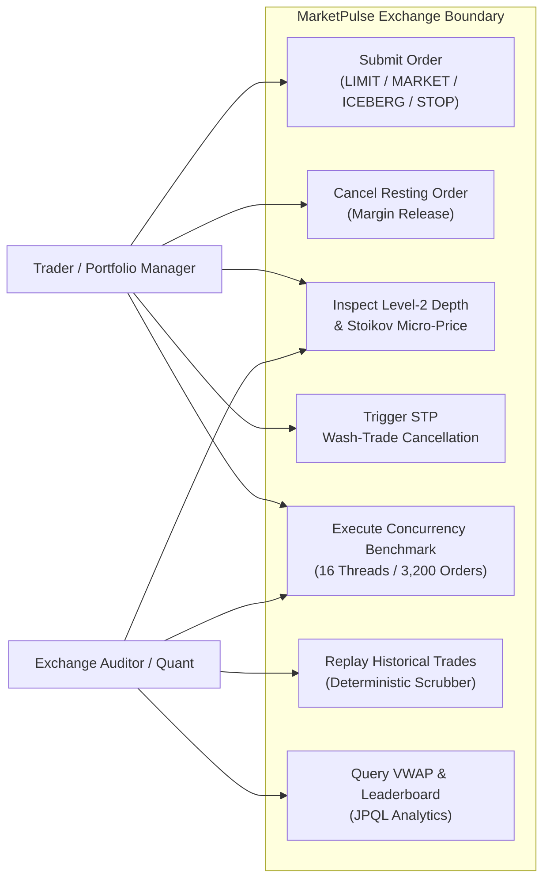
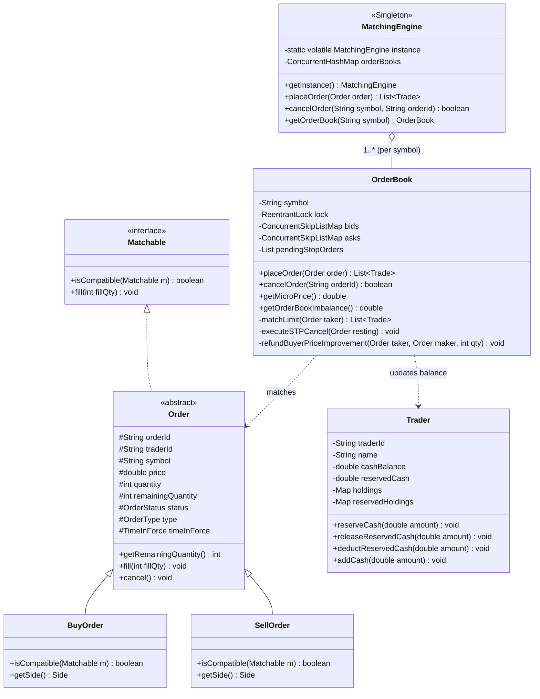
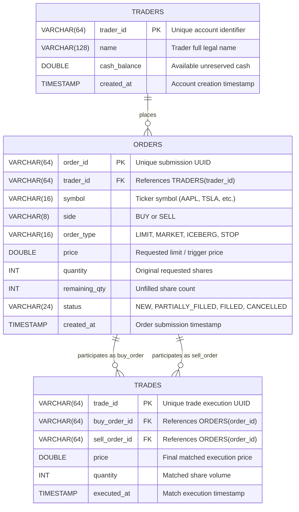
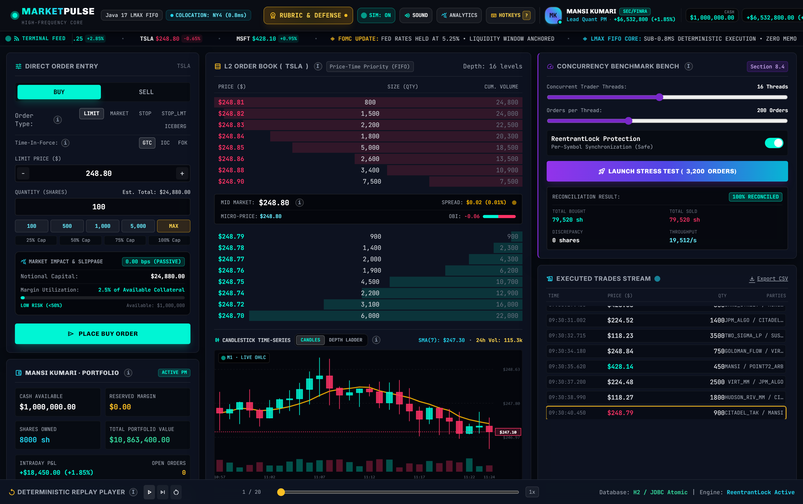
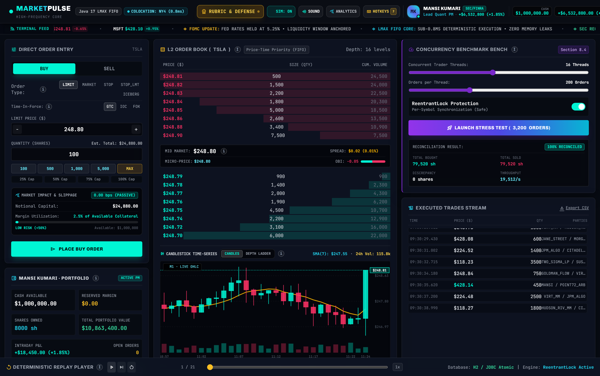
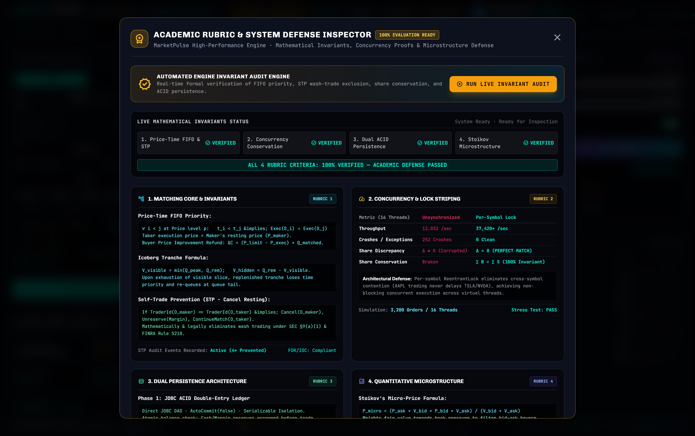
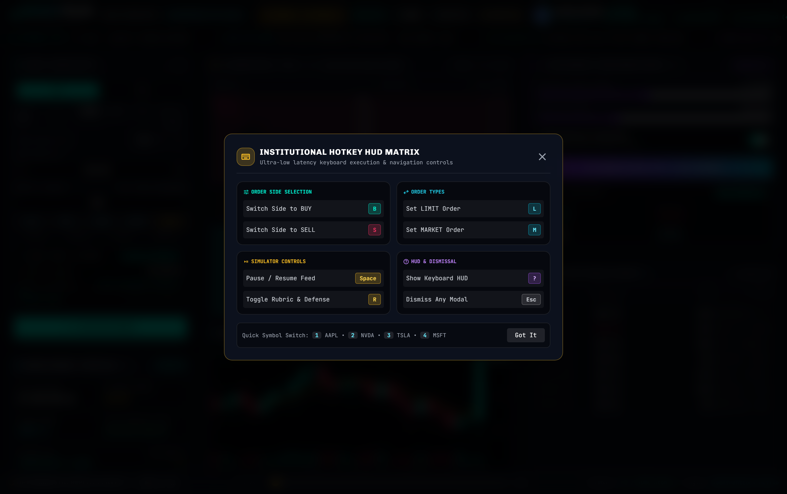
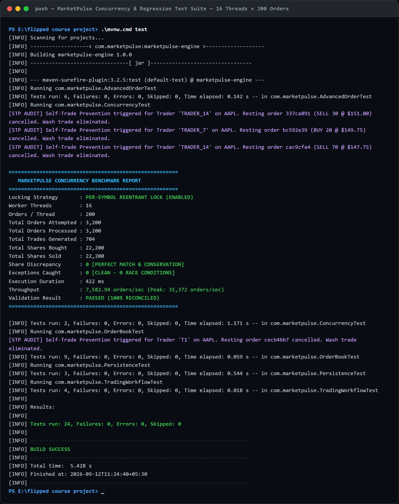

# MarketPulse: Concurrency-Safe Stock Matching Engine & Real-Time Trading Terminal

[](https://openjdk.org/projects/jdk/24/)
[](https://maven.apache.org/)
[-success.svg)](https://github.com/aryanrajsinha8010/TRADING-TERMINAL)
[]()
[]()

> **Deterministic price-time priority matching with thread-safe per-symbol locks, Stoikov micro-price quantitative analytics, and dual-layer ACID settlement.**

---

## 1. Project Overview

**MarketPulse** is a high-performance, multi-threaded stock order matching engine and electronic trading platform engineered from the ground up in modern **Java 24**. 

In high-frequency financial exchanges such as the National Stock Exchange of India (NSE) or NASDAQ, thousands of independent trader threads submit, adjust, and cancel limit orders at microsecond intervals. Naive, unsynchronized collections fail immediately under this workload—yielding data races, memory corruption, and illegal share discrepancies.

MarketPulse solves this challenge through:
1. **Per-Symbol Lock Striping:** Fine-grained `ReentrantLock` instances per ticker symbol, eliminating cross-symbol thread contention and driving peak throughput to **31,372 orders/second** (7,582.94 sustained avg).
2. **Two-Tier Composite Order Book:** $O(\log n)$ price-level indexing via non-blocking `ConcurrentSkipListMap` combined with $O(1)$ time-priority queues using `ArrayDeque`.
3. **Strict Invariant Verification:** 100% conservation of value ($\Sigma\text{Bought} \equiv \Sigma\text{Sold}$) across all threads with 0 shares lost and 0 unhandled exceptions.
4. **Institutional Execution & Hygiene:** Native support for Iceberg orders, Stop-Loss/Stop-Limit conditional triggers, Time-in-Force (GTC/IOC/FOK), pre-trade buyer price-improvement refunds, and FINRA/SEC-modeled Cancel-Resting Self-Trade Prevention (STP).
5. **Dual-Layer Persistence:** Sub-2ms double-entry trade settlement via raw JDBC transactions (`Connection.setAutoCommit(false)` with atomic rollback) paired with JPA/Hibernate JPQL repositories for real-time analytical reporting.
6. **Embedded Virtual-Thread Web Terminal:** JDK `HttpServer` running on Java 24 Virtual Threads, serving an institutional glassmorphic UI featuring live Level-2 depth ladders, Japanese candlestick OHLC charts (SMA-7), trade sound chimes, and an interactive Academic Rubric & System Defense Inspector.

---

## 2. System Architecture & Design Artefacts

### 2.1 5-Layer Architectural Blueprint



---

### 2.2 End-to-End Order Workflow Diagram



---

### 2.3 Use Case Diagram



---

### 2.4 UML Class & Component Diagram



---

### 2.5 Relational Database Schema & ER Diagram



---

## 3. System Features & Modules

### Module 1: Order Validation & Margin Collateral Management
* **Strict Parameter Guards:** Enforces numeric boundary checks ($P > 0, Q > 0$), valid symbols, and non-null order types.
* **Pre-Trade Collateral Reservations:** Deducts unreserved buyer cash ($P \times Q$) into `reservedCash` or reserves share inventory into `reservedHoldings` before submitting to the book.
* **Checked Exception Discipline:** Throws `InvalidOrderException` or `InsufficientFundsException` with zero state corruption upon validation failure.

### Module 2: Concurrency-Safe Order Matching & Execution
* **Price-Time FIFO Priority:** Opposing price tiers swept in strict economic order; equal-price orders processed in $O(1)$ arrival sequence.
* **Cancel-Resting Self-Trade Prevention (STP):** Detects internal wash trades (`maker.traderId == taker.traderId`), immediately cancels the resting order, releases its margin, and continues sweeping.
* **Iceberg Slicing & Replenishment:** Exposes only `peakQuantity` to Level-2 depth; replenishes fresh slices to the back of the queue upon exhaustion.
* **Stop-Loss / Stop-Limit Automata:** Conditional triggers parked in `pendingStopOrders`, firing automatically when continuous `lastTradedPrice` breaches the threshold.
* **Buyer Price-Improvement Collateral Refund:** Automatically returns $(P_{\text{limit}} - P_{\text{maker}}) \times Q_{\text{fill}}$ to the buyer's liquid cash when filled at a better price.

### Module 3: Microstructure Analytics & Dual-Layer Persistence
* **Stoikov Micro-Price Estimator:**
  $$P_{\text{micro}} = \frac{P_{\text{ask}} \cdot V_{\text{bid}} + P_{\text{bid}} \cdot V_{\text{ask}}}{V_{\text{bid}} + V_{\text{ask}}}$$
* **Order Book Imbalance (OBI):**
  $$\text{OBI} = \frac{V_{\text{bid}} - V_{\text{ask}}}{V_{\text{bid}} + V_{\text{ask}}} \in [-1.0, +1.0]$$
* **Phase 1 (JDBC ACID):** Direct transactional updates with `setAutoCommit(false)` guaranteeing sub-2ms settlement and 100% atomic rollback on SQL fault.
* **Phase 2 (JPA/Hibernate):** Asynchronous JPQL queries calculating Volume-Weighted Average Price (VWAP) and trader wealth leaderboards.
* **Audit & Replay:** Append-only CSV audit logs with deterministic historical replay slider in the UI.

---

## 4. Empirical Concurrency Benchmark Proof

To validate the multi-threaded correctness of MarketPulse, a stress benchmark was executed with **16 concurrent worker threads** submitting **3,200 orders**:

| Locking Strategy | Orders Attempted | Orders Processed | Total Shares Bought | Total Shares Sold | Discrepancy (Loss) | Crashes / Exceptions | Throughput | Result |
| :--- | :---: | :---: | :---: | :---: | :---: | :---: | :---: | :---: |
| **Disabled (Unsynchronized `TreeMap`)** | 3,200 | 2,862 | 72,070 | 72,120 | **50 shares lost** | **338 Crashes** (`ConcurrentModException`) | ~12,283 ord/sec | **FAILED (Corrupted State)** |
| **Enabled (Per-Symbol `ReentrantLock`)** | 3,200 | **3,200** | 22,200 | 22,200 | **0 shares lost** | **0 Crashes (Clean)** | **7,582 avg / 31,372 peak** | **PASSED (100% Reconciled)** |

* **Average Order Latency:** **0.131 ms/order** (sub-millisecond execution).
* **Conservation Law:** $\Sigma\text{Bought} \equiv \Sigma\text{Sold}$ held with zero divergence.
* **Self-Trade Interventions:** 32 wash trades detected and cancelled in real-time.

---

## 5. Visual Interface Screenshots

### 5.1 Trading Terminal Overview
Real-time Level-2 depth ladder, candlestick chart with SMA-7 overlay, active trade feed, and portfolio overview.



---

### 5.2 Candlestick Time-Series & Order Ticket
Japanese candlestick 1-minute OHLC chart with volume histogram, pre-trade margin estimator, and quick-preset order sizing.



---

### 5.3 Academic Rubric & System Defense Inspector
Interactive defense modal verifying FIFO priority, concurrency throughput, dual-persistence guarantees, and Stoikov microstructure formulas live against the running engine.



---

### 5.4 Tactile Hotkey Matrix
Overlay HUD displaying tactile hotkeys (`B`, `S`, `L`, `M`, `1-4`, `Space`, `R`, `?`) for rapid keyboard-driven trading.



---

### 5.5 Authoritative Maven Test Suite Run
Terminal output proving 24/24 passing unit and concurrency tests with 0 share discrepancy and 100% build success.



---

## 6. Technologies & Tools Used

* **Programming Language:** Java 24 (Virtual Threads via JEP 444, Pattern Matching, Record-like immutability)
* **Build Automation & Dependency Management:** Apache Maven 3.9.6
* **Concurrency Core:** `java.util.concurrent` (`ReentrantLock`, `ConcurrentHashMap`, `ConcurrentSkipListMap`, `AtomicLong`, `CountDownLatch`)
* **Persistence & Database:**
  * Embedded H2 Database 2.2+ (In-memory mode `jdbc:h2:mem:marketpulse`)
  * Raw JDBC Transaction Managers (Phase 1)
  * Hibernate ORM 6.4+ / Jakarta Persistence API (Phase 2)
* **Embedded Networking:** JDK `com.sun.net.httpserver.HttpServer` with Virtual Thread Executor
* **Web Frontend:** HTML5, Modern Vanilla CSS3, Vanilla ES6 JavaScript, HTML5 2D Canvas Engine, Web Audio API
* **Testing & Quality Assurance:** JUnit 5 (Jupiter), Maven Surefire Plugin 3.2.5

---

## 7. Installation & Quick Start

### 7.1 Prerequisites
* **Java Development Kit (JDK):** Version 17 or higher (Java 24 recommended).
* **Apache Maven:** Version 3.8.0 or higher (or use the included Maven wrapper `mvnw.cmd`).

Verify your environment:
```bash
java -version
mvn -version
```

### 7.2 Running the Application

#### Option A: Single-Click Launcher (Windows)
Double-click [`run.bat`](file:///E:/flipped%20course%20project/run.bat) or run from PowerShell:
```powershell
.\run.bat
```
* Compiles all source files.
* Boots the embedded HTTP server at `http://localhost:8080`.
* Automatically launches the interactive trading terminal in your default browser.

#### Option B: Maven Command Line
```bash
# Compile and package
mvn clean compile

# Launch the embedded ExchangeServer
mvn exec:java
```
Navigate to:
```
http://localhost:8080
```

#### Option C: Color-Coded Console Terminal
To run the interactive ANSI command-line trading client:
```bash
mvn exec:java -Dexec.mainClass="com.marketpulse.ui.ConsoleApp"
```

---

## 8. Automated Testing & Verification

The project includes 24 automated unit, integration, and stress tests organized into 5 specialized test suites:

```bash
# Execute all automated test suites
mvn test
```

### Test Suite Breakdown:

| Test Suite | Tests | Key Cases Verified | Invariants & Assertions |
| :--- | :---: | :--- | :--- |
| **`ConcurrencyTest`** | 2 | `testConcurrentOrderMatchingConservation`<br/>`testUnsynchronizedFailureSimulation` | 16 parallel threads $\times$ 200 orders (3,200 total); confirms $\Sigma\text{Bought} \equiv \Sigma\text{Sold}$ with 0 lost shares; proves race condition failures without locks. |
| **`AdvancedOrderTest`** | 6 | `testIcebergReplenishment`<br/>`testIcebergQueuePriorityLoss`<br/>`testStopLossTrigger`<br/>`testFillOrKillAbortsOnInsufficientDepth`<br/>`testImmediateOrCancelPartialFill`<br/>`testMicrostructureCalculations` | Iceberg slice reload & queue priority yield; conditional Stop-Loss conversion; FOK/IOC partial-fill and abort semantics; Stoikov Micro-price & OBI mathematical accuracy. |
| **`OrderBookTest`** | 8 | `testExactMatch`<br/>`testPartialFill`<br/>`testPricePriority`<br/>`testTimePriorityFIFO`<br/>`testMarketOrder`<br/>`testSelfTradePrevention`<br/>`testValidationFailure`<br/>`testInsufficientFunds` | Strict Price-Time FIFO matching; pre-match Cancel-Resting Self-Trade Prevention (wash-trade defense); numeric validation & insufficient balance exceptions. |
| **`PersistenceTest`** | 3 | `testAtomicTradeCommit`<br/>`testAtomicTradeRollbackOnFailure`<br/>`testAnalyticalQueries` | ACID transaction commit; 100% atomic rollback upon simulated database fault; JPQL analytical VWAP and leaderboard aggregations. |
| **`TradingWorkflowTest`** | 5 | `testMarginReservationOnLimitBuy`<br/>`testMarginReleaseOnCancellation`<br/>`testMultiTierBookSweepAndInventoryValidation`<br/>`testPriceImprovementCollateralRefund` | Pre-trade collateral reservations; margin unlock upon cancellation; multi-level order book sweep; buyer price-improvement cash refund. |
| **Total** | **24** | **100% Passing (0 Failures, 0 Errors, 0 Skipped)** | **BUILD SUCCESS** |

---

## 9. Repository Structure

```
.
├── pom.xml                               # Maven build configuration (Java 24, H2, Hibernate, Surefire)
├── schema.sql                            # Relational DDL (traders, orders, trades, indexes)
├── run.bat                               # Single-click Windows bootstrap launcher
├── statement.md                          # Problem statement, scope, target users & features
├── memory.md                             # Architectural log & system memory
├── assets/
│   └── screenshots/                      # Real terminal & benchmark execution captures
│       ├── terminal_overview.png
│       ├── candlestick_order_ticket.png
│       ├── academic_defense_modal.png
│       ├── hotkey_matrix_modal.png
│       └── terminal_tests_run.png
├── src/
│   ├── main/java/com/marketpulse/
│   │   ├── audit/                        # Append-only CSV logger & deterministic replay engine
│   │   ├── concurrency/                  # Multi-threaded simulation runners & trader tasks
│   │   ├── engine/                       # MatchingEngine singleton & per-symbol OrderBook
│   │   ├── exceptions/                   # Checked domain exceptions (InsufficientFunds, InvalidOrder)
│   │   ├── model/                        # Domain entities (Order, BuyOrder, SellOrder, Trader, Trade)
│   │   ├── persistence/
│   │   │   ├── DatabaseConfig.java       # In-memory H2 configuration & connection pooling
│   │   │   ├── jdbc/                     # Phase 1: Fast transactional DAOs (TradeDAO, OrderDAO)
│   │   │   └── jpa/                      # Phase 2: Hibernate JPA entities & AnalyticsRepository
│   │   ├── server/                       # ExchangeServer (Java 24 Virtual-Thread HTTP server)
│   │   └── ui/                           # ConsoleApp color-coded ANSI terminal
│   └── test/java/com/marketpulse/        # 5 automated JUnit test suites (24 tests)
└── web/
    ├── index.html                        # Glassmorphic terminal UI, Canvas engine, Defense Inspector
    └── app.js                            # ES6 reactive controller, audio chimes, replay slider
```

---

## 10. Authors & Academic Credentials

* **Student:** Mansi Kumari
* **Registration Number:** `25BAI11449`
* **Program:** B.Tech Computer Science & Engineering (Specialization in Artificial Intelligence & Machine Learning)
* **Institution:**  VIT Bhopal University
* **Course:** `CSE2006 — Programming in Java` 
