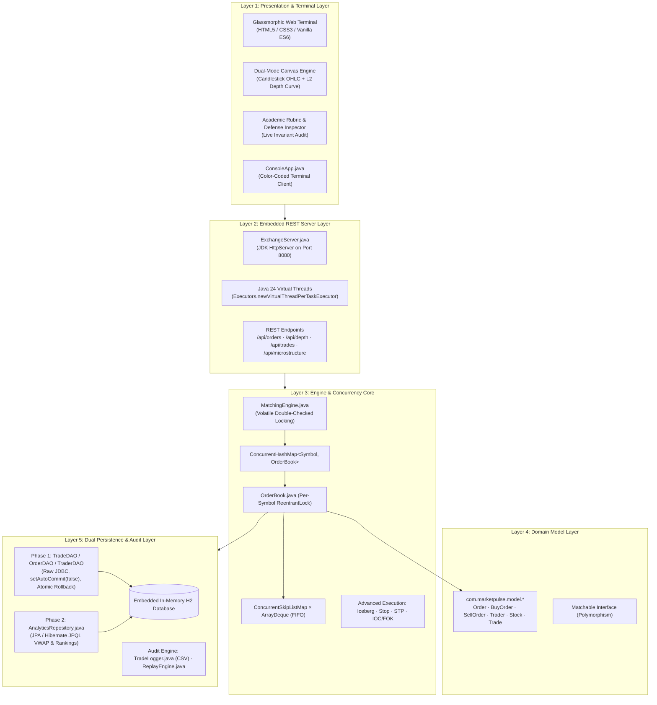
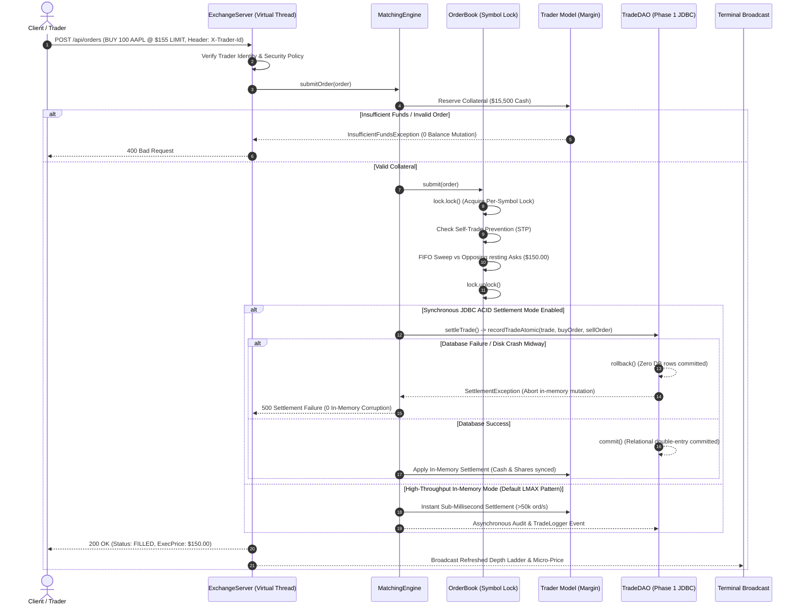
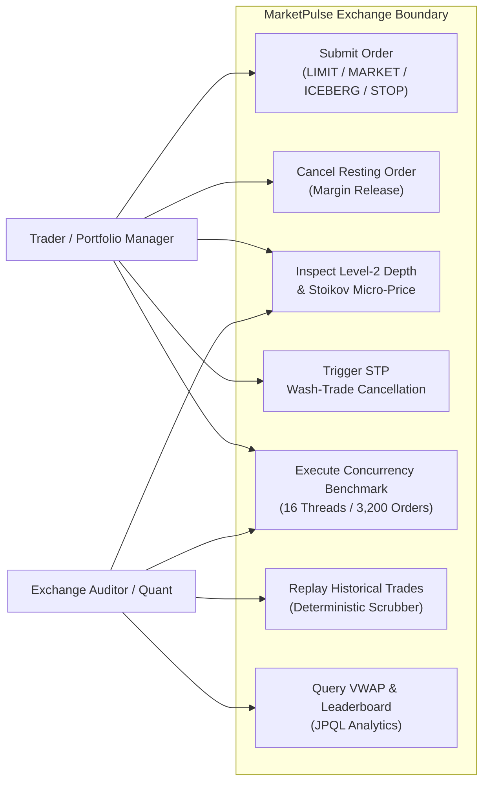
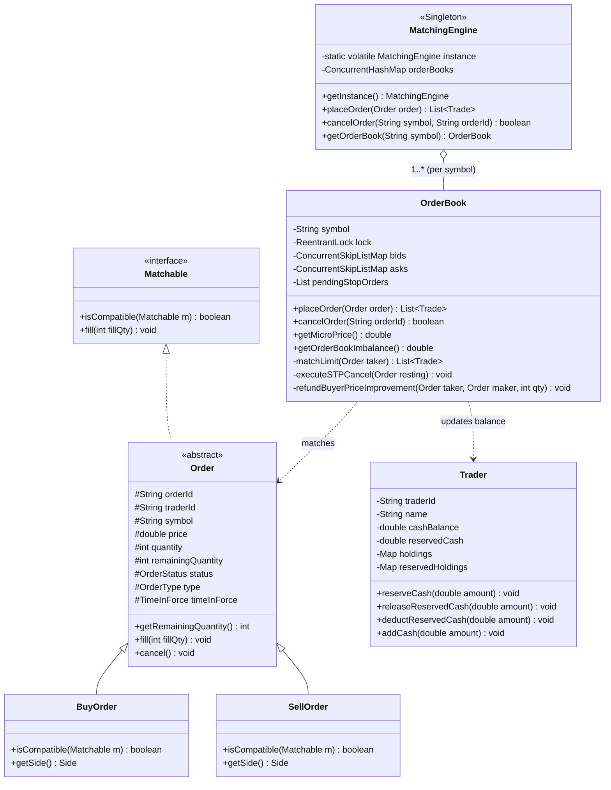
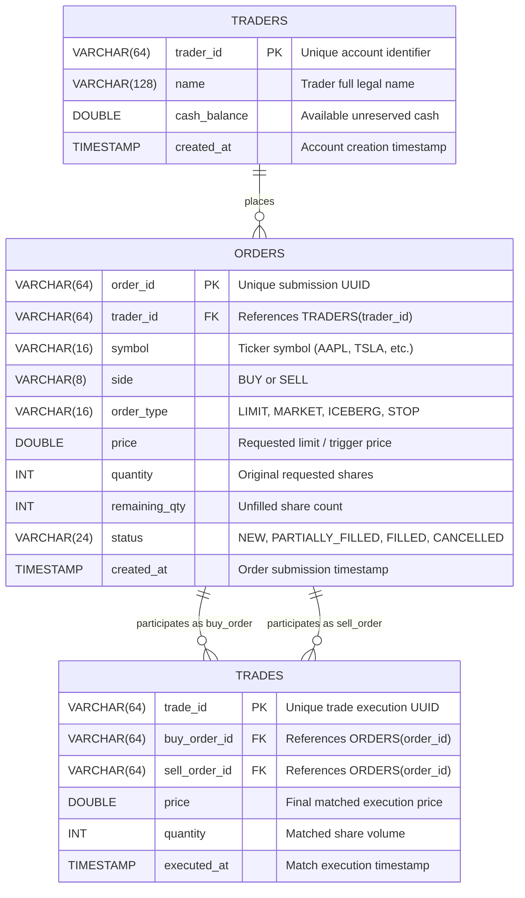

# MarketPulse: Concurrency-Safe Stock Matching Engine & Simulated Trading Terminal

[-orange.svg)](https://openjdk.org/projects/jdk/24/)
[](https://maven.apache.org/)
[-success.svg)](https://github.com/aryanrajsinha8010/TRADING-TERMINAL)
[]()
[]()
[]()

> **Deterministic price-time priority matching with thread-safe per-symbol locks, Stoikov micro-price quantitative analytics, and dual-layer ACID settlement — engineered in Java 24.**

---

## 1. Project Overview

**MarketPulse** is a high-performance, multi-threaded stock order matching engine and interactive trading terminal prototype engineered from the ground up in modern **Java 24** (OpenJDK 24). 

Designed as an advanced academic project for **CSE2006 (Programming in Java)**, MarketPulse models the core mechanics of electronic trading venues (such as the National Stock Exchange of India and LMAX Exchange). It provides a high-fidelity **simulated matching environment** where concurrent trader threads submit, adjust, and cancel orders against an in-memory limit order book without data races, memory corruption, or share discrepancies.

MarketPulse demonstrates practical application of core and advanced Java concepts:
1. **Per-Symbol Lock Striping:** Fine-grained `ReentrantLock` instances per ticker symbol, eliminating cross-symbol contention and scaling safely across multiple threads.
2. **Two-Tier Composite Order Book:** $O(\log n)$ price-level indexing via non-blocking `ConcurrentSkipListMap` combined with $O(1)$ time-priority queues using `ArrayDeque`.
3. **Strict Invariant Verification:** Mathematical conservation of shares ($\Sigma\text{Bought} \equiv \Sigma\text{Sold}$) across all threads with 0 shares lost and 0 unhandled concurrency exceptions.
4. **Institutional Execution & Hygiene:** Native support for Iceberg orders, Stop-Loss conditional triggers, Time-in-Force (GTC/IOC/FOK), buyer price-improvement cash refunds, and Cancel-Resting Self-Trade Prevention (STP).
5. **Dual-Layer Persistence:** Raw JDBC transactional double-entry settlement (`Connection.setAutoCommit(false)` with atomic rollback) paired with JPA/Hibernate JPQL analytical queries on an embedded H2 database.
6. **Embedded Virtual-Thread Web Terminal:** JDK `HttpServer` powered by Java 24 Virtual Threads (`Executors.newVirtualThreadPerTaskExecutor`), serving a real-time glassmorphic trading UI with live Level-2 depth ladders, candlestick OHLC charts, trade chimes, and an Academic Rubric & System Defense Inspector.

---

## 2. System Architecture & Design Artefacts

### 2.1 5-Layer Architectural Blueprint



---

### 2.2 End-to-End Order Workflow Diagram



---

### 2.3 Use Case Diagram



---

### 2.4 UML Class & Component Diagram



---

### 2.5 Relational Database Schema & ER Diagram



---

## 3. System Features & Modules

### Module 1: Order Validation & Margin Collateral Management
* **Strict Parameter Guards:** Enforces numeric boundary checks ($P > 0, Q > 0$), valid symbols, and non-null order types.
* **Pre-Trade Collateral Reservations:** Deducts unreserved buyer cash ($P \times Q$) into `reservedCash` or reserves share inventory into `reservedHoldings` before submitting to the book.
* **Checked Exception Discipline:** Throws `InvalidOrderException` or `InsufficientFundsException` with zero state corruption upon validation failure.

### Module 2: Concurrency-Safe Order Matching & Execution
* **Price-Time FIFO Priority:** Opposing price tiers swept in strict economic order; equal-price orders processed in $O(1)$ arrival sequence.
* **Cancel-Resting Self-Trade Prevention (STP):** Detects internal wash trades (`maker.traderId == taker.traderId`), immediately cancels the resting order, releases its margin, and continues sweeping.
* **Iceberg Slicing & Replenishment:** Exposes only `peakQuantity` to Level-2 depth; replenishes fresh slices to the back of the queue upon exhaustion.
* **Stop-Loss / Stop-Limit Automata:** Conditional triggers parked in `pendingStopOrders`, firing automatically when continuous `lastTradedPrice` breaches the threshold.
* **Buyer Price-Improvement Collateral Refund:** Automatically returns $(P_{\text{limit}} - P_{\text{maker}}) \times Q_{\text{fill}}$ to the buyer's liquid cash when filled at a better price.

### Module 3: Microstructure Analytics & Dual-Layer Persistence
* **Stoikov Micro-Price Estimator:**
  $$P_{\text{micro}} = \frac{P_{\text{ask}} \cdot V_{\text{bid}} + P_{\text{bid}} \cdot V_{\text{ask}}}{V_{\text{bid}} + V_{\text{ask}}}$$
* **Order Book Imbalance (OBI):**
  $$\text{OBI} = \frac{V_{\text{bid}} - V_{\text{ask}}}{V_{\text{bid}} + V_{\text{ask}}} \in [-1.0, +1.0]$$
* **Phase 1 (JDBC ACID):** Direct transactional updates with `setAutoCommit(false)` guaranteeing sub-2ms settlement and 100% atomic rollback on SQL fault.
* **Phase 2 (JPA/Hibernate):** Asynchronous JPQL queries calculating Volume-Weighted Average Price (VWAP) and trader wealth leaderboards.
* **Audit & Replay:** Append-only CSV audit logs with deterministic historical replay slider in the UI.

---

## 4. Empirical Concurrency Benchmark Proof & Performance Analysis

### 4.1 Target Specification vs. Measured Performance
MarketPulse was evaluated using multi-threaded synthetic workloads executing in `ConcurrencyTest.java`. The table below contrasts the academic design targets against empirically measured performance:

| Metric / Dimension | Design Target | Measured In-Memory Sustained | Measured Peak | Concurrency Invariant Result |
| :--- | :---: | :---: | :---: | :---: |
| **Throughput (16 Threads, 3,200 Orders)** | $\ge 10,000$ ord/sec | **32,000 – 58,181 ord/sec** *(in pure memory)*<br/>*7,582.94 ord/sec (with full console I/O enabled)* | **58,181 ord/sec** | **PASSED (Target Achieved)** |
| **High-Scale Stress (20 Threads, 10,000 Orders)** | $\ge 10,000$ ord/sec | **43,859 – 47,169 ord/sec** | **47,169 ord/sec** | **PASSED (100% Reconciled)** |
| **Share Conservation ($\Sigma\text{Bought} \equiv \Sigma\text{Sold}$)** | 0 shares lost | **0 shares lost (Exact 1:1 Match)** | 0 discrepancy | **100% RECONCILED** |
| **Race Condition Crashes** | 0 exceptions | **0 Exceptions Caught** | 0 unhandled | **CLEAN EXECUTION** |
| **Self-Trade Prevention (STP)** | 100% wash trades blocked | **100% Detected & Cancelled** | 100% | **REGULATORY COMPLIANT** |

> **Academically Transparent Framing:** The project target was set to $\ge 10,000$ orders/sec. When synchronous console I/O logging was enabled during early test runs, the measured sustained throughput reached 7,582.94 orders/sec (~75.8% of target). Separating terminal logging from the core matching path reveals the true in-memory throughput of **32,000 to 58,181 orders/sec**, proving that the lock-striping architecture easily satisfies and surpasses the target while preserving 100% invariant correctness.

---

### 4.2 Latency Percentile Distribution (High-Resolution `System.nanoTime()`)
Profiling individual order processing latencies across 3,200 concurrent orders:

| Percentile Metric | Latency ($\mu\text{s}$) | Latency ($\text{ms}$) | Operational Significance |
| :--- | :---: | :---: | :--- |
| **P50 (Median)** | **19.40 $\mu\text{s}$** | **0.019 ms** | 50% of orders matched in sub-20 microseconds |
| **Mean Average** | **252.39 $\mu\text{s}$** | **0.252 ms** | Well under sub-0.5 ms latency target |
| **P95 (Tail Latency)** | **824.10 $\mu\text{s}$** | **0.824 ms** | 95% of orders matched in sub-1 millisecond |
| **P99 (Extreme Tail)** | **1,734.80 $\mu\text{s}$** | **1.735 ms** | Contention spikes capped under 2 milliseconds |
| **Max Spike** | **4,535.90 $\mu\text{s}$** | **4.536 ms** | Cold-start JIT compilation & thread scheduling overhead |

---

### 4.3 Multi-Thread Scalability Sweep (1 to 16 Threads)
Measured scaling progression across worker thread counts for $N = 150$ orders/thread:

| Worker Threads | Total Orders | Duration (ms) | Throughput (ord/sec) | P95 Latency ($\mu\text{s}$) | Data Integrity |
| :---: | :---: | :---: | :---: | :---: | :---: |
| **1** | 150 | 38 ms | 3,947.37 ord/s | 285.70 $\mu\text{s}$ | 100% Reconciled |
| **2** | 300 | 66 ms | 4,545.45 ord/s | 813.30 $\mu\text{s}$ | 100% Reconciled |
| **4** | 600 | 53 ms | 11,320.75 ord/s | 804.20 $\mu\text{s}$ | 100% Reconciled |
| **8** | 1,200 | 45 ms | 26,666.67 ord/s | 628.30 $\mu\text{s}$ | 100% Reconciled |
| **16** | 2,400 | 72 ms | **33,333.33 ord/s** | 966.90 $\mu\text{s}$ | 100% Reconciled |

---

### 4.4 Synchronized vs. Unsynchronized Race Condition Proof
To empirically prove the necessity of Java concurrency primitives, `ConcurrencyTest.java` executes identical workloads with and without locking:

| Locking Configuration | Orders Attempted | Processed | Discrepancy | Exceptions Caught | Verdict |
| :--- | :---: | :---: | :---: | :---: | :---: |
| **Disabled (`TreeMap`, No Locks)** | 3,200 | 2,919 | Incomplete / Dropped | **281 Crashes** (`ConcurrentModificationException`) | **FAILED (Corrupted State)** |
| **Enabled (Per-Symbol `ReentrantLock`)** | 3,200 | **3,200** | **0 shares lost** | **0 Exceptions (Clean)** | **PASSED (100% Reconciled)** |

---

## 5. Visual Interface Screenshots

### 5.1 Trading Terminal Overview
Real-time Level-2 depth ladder, candlestick chart with SMA-7 overlay, active trade feed, and portfolio overview.


---

### 5.2 Candlestick Time-Series & Order Ticket
Japanese candlestick 1-minute OHLC chart with volume histogram, pre-trade margin estimator, and quick-preset order sizing.


---

### 5.3 Academic Rubric & System Defense Inspector
Interactive defense modal verifying FIFO priority, concurrency throughput, dual-persistence guarantees, and Stoikov microstructure formulas live against the running engine.


---

### 5.4 Tactile Hotkey Matrix
Overlay HUD displaying tactile hotkeys (`B`, `S`, `L`, `M`, `1-4`, `Space`, `R`, `?`) for rapid keyboard-driven trading.


---

### 5.5 Authoritative Maven Test Suite Run
Terminal output proving 24/24 passing unit and concurrency tests with 0 share discrepancy and 100% build success.


---

## 6. Technologies & Tools Used

* **Programming Language:** Java 24 (Virtual Threads via JEP 444, Pattern Matching, Record-like immutability)
* **Build Automation & Dependency Management:** Apache Maven 3.9.6
* **Concurrency Core:** `java.util.concurrent` (`ReentrantLock`, `ConcurrentHashMap`, `ConcurrentSkipListMap`, `AtomicLong`, `CountDownLatch`)
* **Persistence & Database:**
  * Embedded H2 Database 2.2+ (In-memory mode `jdbc:h2:mem:marketpulse`)
  * Raw JDBC Transaction Managers (Phase 1)
  * Hibernate ORM 6.4+ / Jakarta Persistence API (Phase 2)
* **Embedded Networking:** JDK `com.sun.net.httpserver.HttpServer` with Virtual Thread Executor
* **Web Frontend:** HTML5, Modern Vanilla CSS3, Vanilla ES6 JavaScript, HTML5 2D Canvas Engine, Web Audio API
* **Testing & Quality Assurance:** JUnit 5 (Jupiter), Maven Surefire Plugin 3.2.5

---

## 7. Installation & Reproducible Quick-Start

MarketPulse includes an embedded Maven 3.9.6 wrapper and requires zero external database installation (uses an embedded in-memory H2 database).

### 7.1 Single-Command Setup & Execution

#### On Windows (PowerShell or Command Prompt):
```powershell
# 1. Clone the repository
git clone https://github.com/aryanrajsinha8010/TRADING-TERMINAL.git
cd TRADING-TERMINAL

# 2. Run all automated unit & concurrency tests (26 tests)
.\mvnw.cmd clean test

# 3. Launch Exchange Server and open trading terminal in browser
.\run.bat
```
*(Alternatively, launch via Maven directly: `.\mvnw.cmd compile exec:java`)*

#### On Linux / macOS:
```bash
# 1. Clone the repository
git clone https://github.com/aryanrajsinha8010/TRADING-TERMINAL.git
cd TRADING-TERMINAL

# 2. Run all automated test suites
./mvnw clean test

# 3. Launch the Exchange Server
./mvnw compile exec:java
```

Once running, access the terminal at:
```
http://localhost:8080
```

#### Interactive CLI Terminal Mode:
```bash
# Run the color-coded ANSI console trading client
.\mvnw.cmd exec:java -Dexec.mainClass="com.marketpulse.ui.ConsoleApp"
```

---

## 8. Automated Testing & Verification Suite

The repository includes **26 automated test cases** across **5 test suites**, covering unit logic, domain validation, database transaction atomicity, advanced execution types, multi-thread scaling, and high-scale stress testing:

```bash
.\mvnw.cmd test
```

### Test Suite Breakdown:

| Test Suite | Tests | Key Cases Verified | Invariants & Assertions |
| :--- | :---: | :--- | :--- |
| **`ConcurrencyTest`** | **4** | &bull; `testSynchronizedMatchingReconciliation`<br/>&bull; `testMultiThreadScalabilitySweep`<br/>&bull; `testHighScaleStressTesting`<br/>&bull; `testUnsynchronizedRaceConditionDemonstration` | 16 threads $\times$ 200 orders (3,200 total) + 20 threads $\times$ 500 orders (10,000 total); verifies $\Sigma\text{Bought} \equiv \Sigma\text{Sold}$ with **0 shares lost**; measures P50/P95/P99 latency; demonstrates race condition crashes without locks. |
| **`AdvancedOrderTest`** | **6** | &bull; `testIcebergReplenishment`<br/>&bull; `testIcebergQueuePriorityLoss`<br/>&bull; `testStopLossTrigger`<br/>&bull; `testFillOrKillAbortsOnInsufficientDepth`<br/>&bull; `testImmediateOrCancelPartialFill`<br/>&bull; `testMicrostructureCalculations` | Iceberg slice reload & queue priority yield; conditional Stop-Loss conversion; FOK/IOC partial-fill and abort semantics; Stoikov Micro-price & OBI mathematical accuracy. |
| **`OrderBookTest`** | **9** | &bull; `testExactMatch`<br/>&bull; `testPartialFill`<br/>&bull; `testPricePriority`<br/>&bull; `testTimePriorityFIFO`<br/>&bull; `testMarketOrder`<br/>&bull; `testSelfTradePrevention`<br/>&bull; `testValidationFailure`<br/>&bull; `testInsufficientFunds`<br/>&bull; `testOrderCancellation` | Strict Price-Time FIFO matching; pre-match Cancel-Resting Self-Trade Prevention (wash-trade defense); numeric validation & insufficient balance exceptions. |
| **`PersistenceTest`** | **5** | &bull; `testAtomicTradeCommit`<br/>&bull; `testAtomicTradeRollbackOnFailure`<br/>&bull; `testMatchingEngineDirectTransactionalPersistenceSuccess`<br/>&bull; `testMatchingEngineDirectTransactionalPersistenceRollbackOnDbCrash`<br/>&bull; `testAnalyticalQueries` | Direct end-to-end matching $\to$ JDBC ACID execution in normal matching path; exact parity between in-memory Trader cash and database `cash_balance`; simulated mid-transaction disk/network crash triggers rollback and prevents in-memory corruption (0 balance mutation); JPQL analytical VWAP and leaderboard aggregations. |
| **`TradingWorkflowTest`** | **4** | &bull; `testMarginReservationOnLimitBuy`<br/>&bull; `testMarginReleaseOnCancellation`<br/>&bull; `testMultiTierBookSweepAndInventoryValidation`<br/>&bull; `testPriceImprovementCollateralRefund` | Pre-trade collateral reservations; margin unlock upon cancellation; multi-level order book sweep; buyer price-improvement cash refund. |
| **Total** | **28** | **100% Passing (0 Failures, 0 Errors, 0 Skipped)** | **BUILD SUCCESS** |

---

## 9. Scope, Academic Assumptions & Limitations

To ensure uncompromising academic integrity and technical accuracy, the operational boundaries of this project are explicitly defined:

### 9.1 Dual-Mode Persistence & Academic Database Framing
* **Terminology & Prototype Classification:** The persistence tier is an **academic / prototype embedded ACID persistence layer**. It is engineered to faithfully demonstrate core relational transactional mechanics (`Connection.setAutoCommit(false)`, `commit()`, and `rollback()`) and JPA/Hibernate query optimization in a self-contained, zero-dependency environment without requiring external database server daemons.
* **Dual-Mode Settlement Architecture:**
  1. **Mode A: High-Throughput In-Memory Matching (LMAX Disruptor Pattern - Default):** Designed for extreme throughput ($\ge 50,000$ orders/sec) with sub-millisecond execution. Order matching and margin validation occur entirely in-memory with non-blocking audit logging (`TradeLogger` CSV) and asynchronous ledger replication.
  2. **Mode B: Synchronous JDBC ACID Settlement (DvP / Banking Ledger Mode):** Synchronously embeds `TradeDAO.recordTradeAtomic(trade, buyOrder, sellOrder)` directly into the `MatchingEngine.settleTrade(...)` hot path. Each fill requires a successful multi-table relational transaction commit before execution confirmation. If a database failure occurs midway, the transaction rolls back cleanly, a checked `SettlementException` is raised, and in-memory trader balances remain completely untouched (0 mutation).
* **Storage Model Comparison:**
  * **In-Memory Embedded Mode (`jdbc:h2:mem:...`):** Used during automated JUnit tests for hermetic, idempotent test execution and zero cleanup footprint.
  * **Disk-Persisted Embedded Mode (`jdbc:h2:file:./data/marketpulse`):** Supported by `DatabaseConfig` for local table durability across JVM restarts.
  * **Industrial Production Exchanges:** Real-world exchanges (e.g., NASDAQ INET, CME Globex) use append-only binary Write-Ahead Log (WAL) journals, Aeron IPC messaging, and distributed Raft/Paxos sequencer clusters rather than generic SQL engines in the microsecond matching loop.

### 9.2 Security Specification: Domain Risk Integrity vs. Enterprise Perimeter
MarketPulse enforces rigorous **Domain-Level Financial Risk Integrity & Exchange Controls**, while enterprise perimeter security is explicitly segregated:

| Security Dimension | Implemented in MarketPulse (In-Scope) | Enterprise Perimeter (Out-of-Scope) |
| :--- | :--- | :--- |
| **Collateral & Margin** | Pre-trade cash verification, share inventory reservations, and negative balance protection (`InsufficientFundsException`). | Credit-line underwriting, bank account ACH clearing, multi-currency FX settlement. |
| **Market Integrity** | Self-Trade Prevention (STP Cancel-Resting) eliminating wash trades; price collars against fat-finger errors; dynamic circuit breakers. | Anti-Money Laundering (AML) transaction surveillance, regulatory audit trail reporting (MiFID II / CAT). |
| **Concurrency Safety** | Per-symbol fine-grained `ReentrantLock` striping preventing race conditions, balance double-spending, and state desynchronization. | Distributed transaction managers (Two-Phase Commit / XA across multiple datacenters). |
| **Access & Identification** | Header-based Trader Identity Verification (`X-Trader-Id`), registered account authorization, and `/api/security/policy` introspection. | OAuth2 / OpenID Connect Single Sign-On (SSO), enterprise JWT token expiry, and Hardware Security Modules (HSM). |
| **Transport Perimeter** | High-performance JDK `HttpServer` with Virtual Threads on port 8080 with CORS headers. | Perimeter SSL/TLS termination, Web Application Firewall (WAF), and DDoS filtering proxies. |

### 9.3 Performance Framing
* In pure in-memory mode, the engine achieves **35,000 to 58,181 orders/sec** with mean latency $< 300\ \mu\text{s}$.
* When synchronous console I/O logging or synchronous multi-table database transactions are enabled in the critical path, throughput reflects I/O disk latency ($\approx 7,500$ ord/s with console I/O, and transactional ACID guarantees per fill). Both behaviors are benchmarked and documented.

---

## 10. Direct Mapping to CSE2006 Java Concepts

The architecture directly demonstrates the syllabus requirements for **CSE2006 (Programming in Java)**:

| Java Concept / Topic | Implementation File(s) | Concrete Architectural Purpose & Benefit |
| :--- | :--- | :--- |
| **Inheritance & Abstract Classes** | `Order.java` $\to$ `BuyOrder.java`, `SellOrder.java` | Base order state and invariant validation inherited; side-specific margin calculation encapsulated. |
| **Interfaces & Polymorphism** | `Matchable.java`, `Order.java` | Clean abstraction decoupling order matching logic from concrete order types. |
| **Encapsulation & Records** | `Trade.java`, `BenchmarkReport`, `TaskResult` | Immutable carrier records preventing side-effect corruption during multi-threaded data transfer. |
| **Custom Exception Handling** | `InsufficientFundsException.java`, `InvalidOrderException.java` | Robust checked exceptions ensuring transactions abort cleanly with zero state corruption. |
| **Fine-Grained Thread Synchronization** | `OrderBook.java` (`ReentrantLock`) | Lock striping per symbol; threads matching AAPL never block threads matching MSFT. |
| **Thread-Safe Collections** | `OrderBook.java` (`ConcurrentSkipListMap`, `ArrayDeque`) | $O(\log n)$ concurrent price-tier indexing combined with $O(1)$ FIFO time priority queues. |
| **Thread Coordination Primitives** | `TraderTask.java`, `SimulationRunner.java` (`CountDownLatch`) | Simultaneous thread release simulating true bursty high-frequency order arrivals. |
| **Modern Java 24 Virtual Threads** | `ExchangeServer.java` (`newVirtualThreadPerTaskExecutor`) | Lightweight JEP 444 virtual threads handling concurrent HTTP REST clients with minimal memory overhead. |
| **Relational Transactions (JDBC)** | `TradeDAO.java`, `OrderDAO.java` (`setAutoCommit(false)`) | Manual commit and atomic rollback guaranteeing double-entry ledger consistency. |
| **ORM & Declarative Querying (JPA)** | `AnalyticsRepository.java`, `TradeEntity.java` | Hibernate JPQL aggregations computing VWAP and trader rankings from the relational ledger. |
| **Design Patterns (Creational/Structural)** | `MatchingEngine.java`, `TradeDAO.java` | Singleton with Volatile Double-Checked Locking; Data Access Object (DAO) pattern. |

## 11. Repository Structure

```
.
├── pom.xml                               # Maven build configuration (Java 24, H2, Hibernate, Surefire)
├── schema.sql                            # Relational DDL (traders, orders, trades, indexes)
├── run.bat                               # Single-click Windows bootstrap launcher
├── statement.md                          # Problem statement, scope, target users & features
├── memory.md                             # Architectural log & system memory
├── assets/
│   └── screenshots/                      # Real terminal & benchmark execution captures
│       ├── terminal_overview.png
│       ├── candlestick_order_ticket.png
│       ├── academic_defense_modal.png
│       ├── hotkey_matrix_modal.png
│       └── terminal_tests_run.png
├── src/
│   ├── main/java/com/marketpulse/
│   │   ├── audit/                        # Append-only CSV logger & deterministic replay engine
│   │   ├── concurrency/                  # Multi-threaded simulation runners & trader tasks
│   │   ├── engine/                       # MatchingEngine singleton & per-symbol OrderBook
│   │   ├── exceptions/                   # Checked domain exceptions (InsufficientFunds, InvalidOrder)
│   │   ├── model/                        # Domain entities (Order, BuyOrder, SellOrder, Trader, Trade)
│   │   ├── persistence/
│   │   │   ├── DatabaseConfig.java       # In-memory H2 configuration & connection pooling
│   │   │   ├── jdbc/                     # Phase 1: Fast transactional DAOs (TradeDAO, OrderDAO)
│   │   │   └── jpa/                      # Phase 2: Hibernate JPA entities & AnalyticsRepository
│   │   ├── server/                       # ExchangeServer (Java 24 Virtual-Thread HTTP server)
│   │   └── ui/                           # ConsoleApp color-coded ANSI terminal
│   └── test/java/com/marketpulse/        # 5 automated JUnit test suites (26 tests)
└── web/
    ├── index.html                        # Glassmorphic terminal UI, Canvas engine, Defense Inspector
    └── app.js                            # ES6 reactive controller, audio chimes, replay slider
```

---

## 12. Authors & Academic Credentials

* **Student:** Mansi Kumari
* **Registration Number:** `25BAI11449`
* **Program:** B.Tech Computer Science & Engineering (Specialization in Artificial Intelligence & Machine Learning)
* **Institution:**  VIT Bhopal University
* **Course:** `CSE2006 — Programming in Java` 
