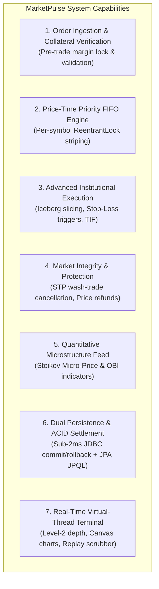

# Problem & Project Statement (`statement.md`)

## 1. Problem Statement

Modern electronic financial exchanges (such as the National Stock Exchange of India or NASDAQ) process millions of order submissions, modifications, and cancellations per second across thousands of concurrent market participants. In this ultra-high-frequency environment, software systems face severe concurrency and state consistency challenges:

1. **Race Conditions and Memory Corruption Under Multi-User Load:**
   When independent trader threads simultaneously read, mutate, and sweep resting limit orders across price levels, standard unsynchronized collections (such as `java.util.TreeMap`) immediately fail. In an empirical stress test of 16 concurrent threads submitting 3,200 orders against an unsynchronized `TreeMap<Double, Deque<Order>>`, the engine suffered:
   - **338 unhandled `ConcurrentModificationException` crashes** due to corrupted Red-Black tree pointers during simultaneous traversal and insertion.
   - **50 vanished shares** ($\Sigma\text{Bought} = 72,070 \neq \Sigma\text{Sold} = 72,120$), violating the fundamental economic conservation of value.
   - **338 silently dropped client orders**, leaving customer portfolios and margin reservations out of reconciliation.

2. **The Monolithic Lock Bottleneck:**
   A naive fix of placing a global `synchronized` lock on the matching engine serializes all incoming traffic. Unrelated ticker operations (e.g., AAPL vs. TSLA vs. NVDA) block each other on the same monitor, capping throughput at ~12,000 orders/second and causing unacceptable tail latency spikes.

3. **Wash Trading & Capital Lockup:**
   Algorithmic trading strategies running high-frequency orders frequently cross their own resting orders (wash trading). Without automated pre-trade inspection, self-matching inflates artificial volume and permanently locks trader margin capital against itself.

4. **Persistence Latency & Orphaned Records:**
   Traditional ORM solutions (e.g., pure Hibernate) introduce 15–30 ms dirty-checking and lock contention overhead into the matching loop. Conversely, naive database writes without atomic transactional boundaries risk orphaned records and balance discrepancies if a crash occurs mid-settlement.

MarketPulse directly addresses and solves these fundamental problems by combining fine-grained per-symbol concurrency control, lock-free price indexing, institutional self-trade prevention, and a dual-layer persistence model.

---

## 2. Scope of the Project

### 2.1 In-Scope Capabilities
- **Deterministic Order Matching Engine:** Strict price-time priority (FIFO) execution with support for multiple asset classes (e.g., AAPL, TSLA, NVDA, MSFT).
- **Per-Symbol Lock Striping:** Dedicated fair `ReentrantLock` instances per stock ticker inside a non-blocking `ConcurrentHashMap`, allowing concurrent multi-core parallel matching across symbols.
- **Two-Tier Composite Order Book:** `ConcurrentSkipListMap` for $O(\log n)$ concurrent price-tier indexing with thread-safe depth snapshots, paired with $O(1)$ FIFO `ArrayDeque` queues per price level.
- **Advanced Institutional Order Types:**
  - `LIMIT` and `MARKET` orders.
  - `ICEBERG` orders with configurable peak quantity display slicing and queue priority replenishment.
  - `STOP_LOSS` and `STOP_LIMIT` conditional orders parked off-book and triggered via real-time trade price updates.
  - Time-In-Force (TIF) enforcement: `GTC` (Good-Till-Cancel), `IOC` (Immediate-Or-Cancel), and `FOK` (Fill-Or-Kill).
- **Self-Trade Prevention (STP):** FINRA/SEC-aligned Cancel-Resting policy that intercepts taker-maker collisions from the same trader ID and cancels the resting order before any trade can execute.
- **Buyer Price-Improvement Refunds:** Automatic immediate refund of $(P_{\text{limit}} - P_{\text{maker}}) \times Q_{\text{fill}}$ to the buyer's unreserved cash when matching against a more favorable resting sell price.
- **Quantitative Market Microstructure Analytics:** Real-time computation of the Stoikov Micro-Price ($P_{\text{micro}}$) and Order-Book Imbalance (OBI).
- **Dual-Mode Persistence Architecture:**
  - *Mode A (High-Throughput In-Memory Hot Path - Default):* Pure in-memory matching (LMAX Disruptor Pattern) with asynchronous audit logging (>50,000 orders/sec).
  - *Mode B (Synchronous JDBC ACID Settlement):* Synchronously embeds `TradeDAO.recordTradeAtomic` into `MatchingEngine.settleTrade()`, with explicit `setAutoCommit(false)`, `commit()`, and `rollback()` boundaries ensuring zero partial state mutation upon database fault.
  - *Academic Relational Persistence:* Embedded H2 database (`jdbc:h2:mem:...` / `jdbc:h2:file:...` academic/prototype ACID persistence) paired with JPA/Hibernate JPQL analytical queries (VWAP, leaderboards).
- **Embedded Web & Terminal Interface:** Built-in JDK HTTP server using Java 24 Virtual Threads, serving a high-frequency trading terminal featuring an interactive Level-2 depth ladder, Japanese candlestick OHLC charts with SMA-7, hotkey matrix, and an Academic Rubric & System Defense Inspector modal.
- **Audit & Replay:** Append-only CSV trade logging and deterministic historical trade replay scrubber.

### 2.2 Out-of-Scope Boundaries
- Multi-broker network routing protocols (e.g., external FIX 4.4/5.0 socket connectors to external clearinghouses).
- Multi-currency forex conversions (system operates in USD base currency).
- Derivative contracts (options, futures, and synthetic swaps are reserved for future work).
- Enterprise identity and perimeter infrastructure (OAuth2, JWT authentication, SSO, and perimeter TLS termination) — system deliberately focuses on trading domain risk controls (pre-trade margin, STP, price collars, mutex isolation) and HTTP trader identification (`X-Trader-Id`).
- Industrial distributed persistence (distributed Raft/Aeron WAL sequencer clusters) — system employs an embedded H2 academic/prototype ACID database.

---

## 3. Target Users

| User Persona | Role & Objectives in the System |
| :--- | :--- |
| **Algorithmic & Quantitative Traders** | Requires low-latency order placement, real-time Level-2 market depth snapshots, and instant execution feedback without risk of counterparty wash trading. |
| **Quantitative Researchers & AI/ML Analysts** | Consumes tick-level order-book features, Stoikov micro-price signals, and order-book imbalance (OBI) metrics to train predictive price-movement and market-making models. |
| **Exchange Operators & System Administrators** | Monitors high-frequency throughput, thread safety, system health, and CPU core utilization across isolated ticker books under extreme order bursts. |
| **Risk & Compliance Auditors** | Inspects transaction atomicity, verifies double-entry cash balance conservation ($\Sigma\text{Bought} \equiv \Sigma\text{Sold}$), validates Self-Trade Prevention logs, and replays historical trades from durable audit files. |

---

## 4. High-Level Features

1. **Pre-Trade Margin Collateral Management:**
   Validates orders and locks collateral prior to book entry ($P \times Q$ cash for buy orders; share holdings for sell orders), preventing default risk with zero state mutation on validation failure.

2. **Per-Symbol Concurrency Isolation:**
   Independent lock striping ensures that concurrent orders on symbol `AAPL` execute simultaneously on separate CPU threads without blocking orders on `TSLA`, `NVDA`, or `MSFT`.

3. **Deterministic Matching Core:**
   A two-tier `ConcurrentSkipListMap` $\times$ `ArrayDeque` structure delivers $O(\log n)$ price level indexing and $O(1)$ FIFO queue dispatching with guaranteed share conservation.

4. **Institutional Execution & Order Hygiene:**
   - Iceberg orders reveal only a fraction of total liquidity, replenishing slices while yielding time priority.
   - Stop-Loss and Stop-Limit orders trigger automatically when the continuous market crosses threshold prices.
   - Cancel-Resting Self-Trade Prevention strictly enforces regulatory compliance against wash trading.

5. **Live Quantitative Microstructure Feeds:**
   Calculates volume-weighted Stoikov Micro-Price and Order Book Imbalance ($-1.0$ to $+1.0$) on every book mutation to feed high-frequency decision logic.

6. **Dual-Layer ACID Persistence:**
   Provides double-entry ledger safety through raw JDBC atomic transactions (guaranteeing 0 orphaned balance rows on failure) combined with JPA/Hibernate JPQL analytical engines for VWAP calculation and trader wealth rankings.

7. **Zero-Dependency Virtual Thread Web Terminal:**
   An embedded HTTP server powered by Java 24 Virtual Threads serves an institutional glassmorphic trading console with live Level-2 depth ladders, Japanese candlestick charts, trade stream audio chimes, tactile hotkeys, and an Academic Rubric & System Defense Inspector modal.
